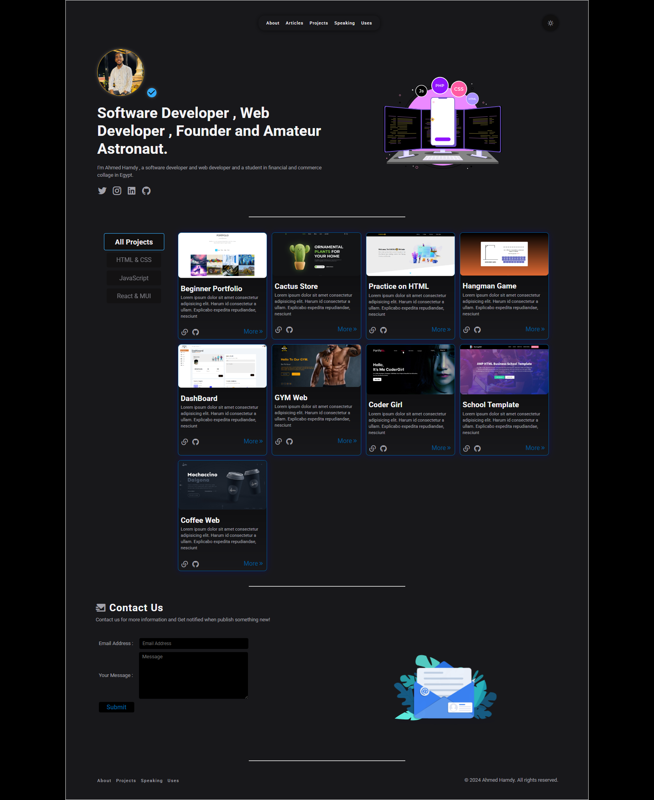

# 🚀 Ahmed Hamdy's Developer Portfolio

A sleek, responsive portfolio built using **React** and **Tailwind CSS**, designed to showcase personal projects, skills, and contact information.

[](https://ahmedhamdy272.github.io/react/)

## ✨ Features

- ⚛️ Built with React
- 🎨 TailwindCSS for styling
- 💡 Dark-themed UI with light animation
- 🧩 Modular project cards filtered by tech (HTML, JS, React)
- 📫 Contact form with email input
- 🌐 Responsive layout (mobile/tablet/desktop)
- 🔗 Social links integration

---

## 🚧 Getting Started
### 🛠 Installation

Clone the repo and install dependencies:

```
git clone https://github.com/ahmedhamdy272/react.git
cd react
npm install
```

### 💻 Development
Start the local development server:

```
npm run dev
Visit: http://localhost:5173
```

### 🏗 Building for Production
To generate a production-ready build:


```
npm run build
```

### 🌍 Deployment
This project is deployable on:

GitHub Pages (already hosted at ahmedhamdy272.github.io/react)

Vercel

Netlify

Firebase Hosting

Just upload the contents of the dist/ folder after running:


```
npm run build
```
---

## 🧾 Project Structure
```
Copy
Edit
react-portfolio/
├── public/
│   └── index.html
├── src/
│   ├── assets/             # images/icons
│   ├── components/         # React components (Cards, Nav, Footer)
│   ├── pages/              # Sections (About, Projects, Contact)
│   ├── App.js
│   └── main.js
├── tailwind.config.js
├── postcss.config.js
├── package.json
├── README.md
└── screenshot01.png
```
---

## 🎨 Styling
TailwindCSS is preconfigured and used throughout for consistent styling and utility-first design.

For custom themes or extending Tailwind:

js
Copy
Edit
```
// tailwind.config.js
module.exports = {
  content: ["./src/**/*.{js,jsx}"],
  theme: {
    extend: {},
  },
  plugins: [],
}
```
---

## 📸 Preview


## 🙋‍♂️ Author
Ahmed Hamdy

🌐 GitHub

## 📃 License
This project is licensed under the MIT License — see the LICENSE file for details.

Built with ❤️ using React and Tailwind CSS.
